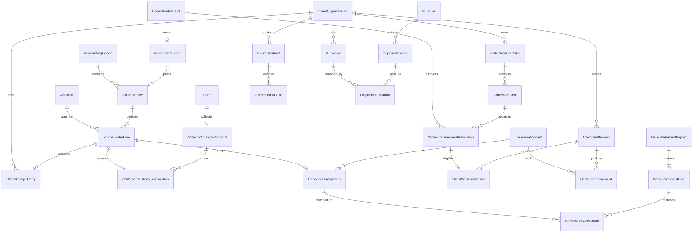

# Accounting & Finance Module — Enterprise Blueprint

**النظام:** MIS Collection Firm  
**حالة الوثيقة:** Approved blueprint with phased implementation in progress  
**تاريخ المراجعة:** 28 أغسطس 2026  
**المبدأ الحاكم:** **Every Pound Must Be Traceable**

> هذه الوثيقة تصميم نظام ورقابة داخلية، وليست فتوى ضريبية. قبل الإنتاج يجب اعتماد المعالجات الضريبية ونقاط الاعتراف بالإيراد لكل نوع عقد بواسطة المستشار الضريبي والمراجع الخارجي للشركة. كل النسب والقواعد الضريبية ستكون Effective-Dated وقابلة للتهيئة، ولن تُكتب كنسب ثابتة في الكود.

## حالة التنفيذ الحالية — 28 أغسطس 2026

تم تنفيذ **Finance Foundation** والجزء التشغيلي الأول من **Collections Financial Integration** فعليًا في الـBackend والواجهة وقاعدة البيانات:

- legal entity، العملات الأساسية، الفترات المحاسبية، دليل الحسابات، Accounting Events، القيود المتوازنة، دفتر العميل، وسجل التدقيق المالي.
- ترحيل التحصيل المعتمد Atomically مع حفظ `CollectionFinancialReceipt` و`CollectionPaymentAllocation` وربط المصدر بالقيد.
- فصل أموال العميل عن الإيراد: إثبات التحصيل يرحّل إلى `Client Funds Clearing` ولا يعترف بإيراد الشركة.
- عهدة نقدية مستقلة لكل محصل، soft/hard limits قابلة للتعديل بصلاحية مالية وسبب مسجل، حركة تحصيل وتوريد وعكس، وربط كل حركة بسطر القيد والإيصال.
- تسوية التحصيل تنقل أصل الأموال إلى البنك وتعيد تصنيف التزام العميل إلى `Client Funds Payable` في قيد متوازن واحد.
- عكس التحصيل من شاشة مالية متخصصة يعكس القيود ودفتر العميل والعهدة ويعيد رصيد الحالة من snapshot محفوظ؛ عكس قيد التحصيل مباشرة من شاشة القيود العامة ممنوع.
- صفحات عربية/إنجليزية للتحصيلات المالية وعهد المحصلين مع drill-down إلى القيود، فلاتر، حالات واضحة، وحدود رقابية.
- Migrations مطبقة: `20260828150335_AddCollectionFinanceCustodyAndClearing` و`20260828151511_StrengthenCollectionFinanceUniqueness`، مع اختبارات Domain وBuild للـBackend والواجهة.

القيود الحالية المعلنة بوضوح:

- المستند التشغيلي الحالي يوزع التحصيل على Case واحدة؛ الـschema يدعم allocations متعددة لكن واجهة/API الإيصال متعدد الحالات لم تُنفذ بعد.
- العملات الأجنبية محجوبة حتى تنفيذ exchange-rate approval وposting profiles الفعالة.
- السداد المباشر للعميل محجوب من مسار company cash حتى تنفيذ `DirectClientPaymentConfirmed` المخصص.
- العقود والعمولات والتسويات، الخزينة التفصيلية، الشيكات، Bank Reconciliation، AP/AR، الضرائب وETA، وMonth-End Close ما زالت مراحل لاحقة ولا تعتبر منفذة.

## ملخص تنفيذي ونتيجة تحليل المشروع الحالي

النظام الحالي مبني كـClean Architecture Modular Monolith باستخدام ASP.NET Core 10 وEF Core وPostgreSQL، مع React/TypeScript في الواجهة. توجد بالفعل كيانات العملاء والمحافظ والحالات والمحصلين والتحصيلات، وصلاحيات على الـBackend، ونطاقات وصول Client/Portfolio، ومبدأ Maker–Checker لاعتماد التحصيل، وAudit وAttachments، واستخدام معاملات Serializable في بعض العمليات الحساسة.

النقاط التي يمكن البناء عليها:

- `ClientOrganization` سيكون مرجع العميل المالي بدل إنشاء جدول عملاء مكرر.
- `CollectionPortfolio` و`CollectionCase` و`User` و`Branch` ستُستخدم كـdimensions مالية.
- `CollectionPayment` الحالي مستند تشغيل، واعتماده هو المرشح الأول لحدث `CollectionConfirmed`.
- نظام الصلاحيات الحالي يقبل permission + scope، لكنه يحتاج صلاحيات مالية أدق ونطاق Branch/Client/Treasury.
- PostgreSQL مناسب للقيود، الفهارس، المعاملات، وJSONB للـsnapshots فقط، مع إبقاء الحقول المالية الأساسية في أعمدة typed.

### خط أساس التحليل قبل بدء التنفيذ

الفجوات التالية تصف حالة النظام التي اكتُشفت عند إعداد التصميم في 25 أغسطس 2026. **حالة التنفيذ الحالية أعلى الوثيقة هي المرجع الأحدث**؛ لذلك أُغلق جزء منها ضمن Finance Foundation وCollections Financial Integration، بينما يبقى الباقي ضمن المراحل المعلنة:

- لا يوجد General Ledger أو Journal Entries أو Accounting Periods.
- لا يوجد فصل مسجل بين أموال العميل وإيراد الشركة.
- لا يوجد Client Subledger أو Collector Custody أو Treasury أو Settlement.
- التحصيل الحالي يحتوي مبلغًا وطريقة ومرجعًا فقط، ولا يحدد العملة أو وجهة المال أو حالة التحصيل البنكي/الشيك أو allocations.
- اعتماد التحصيل يخفض رصيد الحالة مباشرة، لكن لا يوجد reversal مالي كامل يعيد الأثر بطريقة مضبوطة.
- مرجع الدفع unique على النظام كله؛ التصميم المالي يحتاج uniqueness/fingerprint أكثر دقة حسب القناة والحساب والعميل.
- الدقة الحالية `numeric(18,2)` مناسبة لـEGP، لكنها لا تكفي وحدها لأسعار الصرف والعملات متعددة الدقة.
- بيانات `PAID` في DCR هي معلومة متابعة وليست إثبات قبض؛ لن تكون مصدر ترحيل حتى لا يحدث Double Counting.

### قرارات التصميم الأساسية

1. **GL هو المصدر الرسمي الوحيد للقوائم المالية.**
2. **Subledgers غير قابلة للتعديل بعد الترحيل** ومرتبطة بسطر GL.
3. **Client Money Liability وليس Revenue.** الإيراد هو العمولة/الأتعاب فقط.
4. **Operational Document ≠ Accounting Entry.** العلاقة تمر عبر Accounting Event موثّق.
5. **لا حذف لأي Posted Transaction.** التصحيح Reversal ثم Replacement/Adjustment.
6. **المعاملة المالية Atomic.** اعتماد العملية + الحدث + القيد + subledger + audit إما تنجح كلها أو تُلغى كلها.
7. **Idempotency على مستوى قاعدة البيانات** وليس اعتمادًا على منع double-click في الواجهة.
8. **Role مجرد Template.** التفويض النهائي Permission + Scope + Approval Limit + Segregation of Duties.
9. **الضرائب والعقود والقواعد Effective-Dated مع snapshot عند الترحيل.**
10. **المبالغ لا تُجمع من جداول التشغيل لإنتاج القوائم الرسمية.** التشغيل للمصدر والتفاصيل، والـGL للتقرير.

---

## 1. Accounting Module Architecture

الاختيار المناسب للمرحلة الحالية هو **Finance Bounded Context داخل Modular Monolith**، وليس Microservice منفصلًا. هذا يحافظ على Atomicity مع التحصيل في نفس PostgreSQL transaction، ويمنع تعقيد distributed transactions. تُفصل الحدود في namespaces ومجلدات وخدمات وجداول واضحة بحيث يمكن استخراجها مستقبلًا إذا لزم.

```text
Operational Modules
Collections | HR/Payroll | Legal | Procurement
        │  immutable business event + source snapshot
        ▼
Financial Integration Gateway
validation | idempotency | period check | authorization
        │
        ▼
Accounting Event Inbox ── Posting Profiles / Rules / Tax / Contract
        │
        ▼
Posting Engine
balanced entry | numbering | dimensions | approval | reversal links
        │
        ├──────── General Ledger (official books)
        ├──────── Client Subledger
        ├──────── Collector Custody Subledger
        ├──────── Treasury Subledger
        ├──────── AR/AP Subledgers
        └──────── Financial Audit Log
                         │
              Reconciliation & Reporting Layer
```

### المكونات

- **Finance Domain:** Journal, Account, Period, Settlement, Custody, Treasury, Invoice, Expense, Reconciliation.
- **Financial Integration Gateway:** عقد واحد لاستقبال الأحداث من التشغيل، وليس استدعاءات عشوائية للـGL.
- **Accounting Event Inbox:** سجل دائم لكل حدث مع `EventId`, `EventType`, `SourceType`, `SourceId`, `PayloadSnapshot`, `OccurredAt`, `IdempotencyKey`, `Status`.
- **Posting Engine:** يقرأ نسخة Posting Profile الفعالة في تاريخ العملية، يبني القيد، يتحقق من توازنه، ثم يرحّله.
- **Posting Rules:** mapping قابل للتهيئة للأحداث والحسابات والأبعاد، مع versioning وeffective dates واعتماد قبل التفعيل.
- **Subledger Writers:** تكتب قيود العملاء/العهد/الخزينة/AR/AP في نفس transaction وترتبط بـ`JournalEntryLineId`.
- **Reporting Read Models:** views/materialized summaries للتقارير الثقيلة؛ لا تغيّر الحقيقة المحاسبية.
- **Reconciliation Engine:** يقارن التشغيل ↔ subledger ↔ GL ويولد exceptions.
- **Outbox:** يستخدم للإشعارات، ETA submission، exports، وتحديث read models؛ لا يستخدم لتأجيل قيد يجب أن يكون Atomic مع اعتماد التحصيل.

### اتساق البيانات

- العمليات القصيرة الحساسة: transaction واحدة مع isolation مناسب وunique constraints.
- الترحيل الجماعي: batches صغيرة، كل event مستقل idempotent، مع checkpoint وretry.
- لا تظهر القيود `DRAFT/VALIDATED` في التقارير؛ التقارير تقرأ `POSTED` فقط.
- إجمالي debit/credit يُتحقق منه في domain service قبل `POSTED` مع transaction وقفل، ويمكن إضافة deferred database trigger كحاجز أخير.

---

## 2. Complete Module Sitemap

```text
Finance
├─ Command Center
│  ├─ Finance Dashboard
│  ├─ Daily Operations
│  ├─ Alerts & Exceptions
│  └─ Approval Inbox
├─ General Ledger
│  ├─ Chart of Accounts
│  ├─ Journals
│  ├─ Manual Journals
│  ├─ Posting Monitor / Failed Events
│  ├─ Fiscal Years & Periods
│  └─ Opening Balances
├─ Client Finance
│  ├─ Client Financial Profile
│  ├─ Client Ledger
│  ├─ Contracts & Fee Rules
│  ├─ Settlement Workbench
│  ├─ Settlement Statements
│  └─ Client Adjustments / Recoverables
├─ Collector Custody
│  ├─ Custody Accounts
│  ├─ Cash Collections
│  ├─ Deposits & Handover
│  ├─ Shortage / Overage
│  ├─ Daily Reconciliation
│  └─ Limits & Aging
├─ Treasury
│  ├─ Cashboxes / Petty Cash
│  ├─ Bank Accounts
│  ├─ Payment Gateways
│  ├─ Receipts / Payments
│  ├─ Internal Transfers
│  ├─ Cheques
│  └─ Treasury Statements
├─ Bank Reconciliation
│  ├─ Statement Imports
│  ├─ Matching Workspace
│  ├─ Unidentified Receipts
│  └─ Reconciliation Runs
├─ Expenses & Payables
│  ├─ Expense Vouchers
│  ├─ Suppliers
│  ├─ Supplier Invoices / Notes
│  ├─ Payment Runs
│  └─ AP Aging
├─ Receivables
│  ├─ Client Invoices
│  ├─ Credit / Debit Notes
│  ├─ Receipts & Allocations
│  └─ AR Aging
├─ Tax
│  ├─ Tax Codes & Treatments
│  ├─ VAT / WHT Registers
│  ├─ ETA Documents
│  └─ Submission Monitor
├─ Reconciliation Center
├─ Financial Reports
├─ Month-End Closing
└─ Finance Setup
   ├─ Currencies / Rates / Rounding
   ├─ Cost Centers / Branches
   ├─ Posting Profiles
   ├─ Approval Policies
   ├─ Number Sequences
   └─ Document / Attachment Policies
```

---

## 3. Accounting Workflow

```text
Source Document Created
→ business validation
→ Submitted
→ approval workflow / SoD
→ Accounting Event created with unique idempotency key
→ posting rule resolved by event + legal entity + contract + channel + date
→ draft lines generated
→ account/dimension/period/currency/tax validation
→ Total Debit = Total Credit
→ journal number reserved
→ POSTED atomically with subledger and audit
→ source marked FinanciallyPosted
→ read models/reconciliation updated through outbox
```

حالات الـJournal: `DRAFT`, `PENDING_APPROVAL`, `APPROVED`, `POSTED`, `REVERSED`, `POSTING_FAILED`. لا يوجد `DELETED` بعد الترحيل.

الـManual Journal يمر بنفس المحرك، لكن مصدره `MANUAL_JOURNAL` ويحتاج attachment واعتمادًا حسب المخاطر. لا يستطيع منشئه اعتماده أو ترحيله إذا كان policy يتطلب SoD.

---

## 4. Collection-to-Accounting Workflow

### مصدر الحقيقة

- DCR `PAID` = ادعاء/متابعة تشغيلية فقط.
- `CollectionPayment SUBMITTED` = مستند تحصيل غير مالي.
- `CollectionPayment APPROVED` بعد استكمال قناة الدفع والوجهة والعملة والـallocations = `CollectionConfirmed` وهو مصدر القيد.

### التدفق

1. إدخال receipt واحد يمكن توزيعه على Case واحدة أو عدة Cases عبر `CollectionPaymentAllocations`.
2. التحقق من client/portfolio/case ownership، العملة، المبلغ، reference، duplicate fingerprint، proof.
3. Maker–Checker يعتمد التحصيل.
4. داخل transaction واحدة:
   - تثبيت allocations وتحديث الأرصدة التشغيلية.
   - إنشاء `AccountingEvent(CollectionConfirmed)`.
   - ترحيل Dr إلى channel asset وCr إلى Client Funds Clearing.
   - إنشاء Client Subledger credit وCustody/Treasury subledger debit.
   - كتابة audit وربط `JournalEntryId` بالمصدر.
5. clearing/deposit event ينقل المال بين الأصول فقط، فلا يعيد زيادة رصيد العميل.
6. عندما يصبح المبلغ eligible للتسوية: reclass من Client Funds Clearing إلى Client Funds Payable إن كانت السياسة تفرق بينهما.

### حالات القناة

- Cash with collector → Collector Custody.
- Cash at branch → Undeposited Collections أو Branch Cash.
- Bank transfer received → Bank Clearing ثم Bank بعد reconciliation حسب السياسة.
- Cheque → Cheques Under Collection، ثم Bank عند clearance.
- Gateway/wallet/POS → Gateway Receivable، ثم Bank عند payout net of fees.
- Direct payment to client → يقلل دين الحالة تشغيليًا، لكنه لا ينشئ company cash أو client-money liability؛ يُستخدم memo/client ledger event، وقد يولد fee receivable حسب العقد.

---

## 5. Client Settlement Workflow

```text
Select Client + Period + Currency
→ system locks eligible cleared collection lines
→ calculates opening payable
→ gross collections
→ reversals/refunds/adjustments
→ fee rules snapshot
→ tax rules snapshot
→ net payable preview
→ Draft
→ Submitted / Accountant review
→ Finance Manager approval
→ settlement journal posted
→ payment voucher(s)
→ Partially Paid / Paid
→ PDF/Excel statement + audit
```

ضوابط أساسية:

- كل collection line لا تدخل أكثر من settlement واحدة فعالة؛ unique constraint على `CollectionTransactionId` للحالات غير الملغاة.
- Draft يعاد حسابه قبل submit. بعد submit تُثبت source lines وrule versions.
- Approved/Paid لا يُعدل؛ dispute أو خطأ ينتج Adjustment/Reversal.
- partial payment يُسجل allocation منفصل، ولا يغير أصل settlement.
- fee model يدعم `NET_FROM_CLIENT_FUNDS` أو `INVOICE_CLIENT_SEPARATELY`.
- revenue recognition timing إعداد تعاقدي: عند تحصيل مؤهل، أو clearance، أو settlement approval، وليس اختيارًا يدويًا لكل عملية.
- statement يحتفظ بنسخة أسماء العميل والعقد والضرائب والعمولة وقت الإصدار حتى لا يتغير تاريخيًا عند تعديل master data.

---

## 6. Collector Custody Workflow

```text
Cash Collection Approved
→ Dr Collector Custody / Cr Client Funds Clearing
→ custody balance and aging updated
→ collector hands over full/partial cash
→ counted by cashier (maker/checker)
→ Dr Cashbox/Undeposited / Cr Collector Custody
→ deposit to bank: Dr Bank Clearing / Cr Cashbox/Undeposited
→ bank match: clear bank reconciliation item
```

لكل محصل حساب subledger لا حساب GL منفصل. حساب GL control واحد أو حسب الفرع، والـcollector dimension يحدد الرصيد الفردي.

الحساب يعرض: opening، cash collected، handed over، approved custody expenses، shortage، overage، adjustments، closing، oldest outstanding date.

الحدود:

- `SoftLimit`: alert + supervisor notification.
- `HardLimit`: يمنع cash collection الجديد، مع override permission وdual approval.
- aging thresholds per branch/collector policy.
- shortage لا يخفض Client Funds Payable؛ يُسجل كـCollector Receivable أو Loss Pending Investigation حسب قرار معتمد.

---

## 7. Treasury Workflow

كل `TreasuryAccount` مرتبط بـGL account واحد، وله نوع `CASHBOX`, `BANK`, `PETTY_CASH`, `GATEWAY`, `WALLET`, `IN_TRANSIT` وعملة وفرع ومسؤول وحد سالب.

- Cash In/Out: source voucher + approval + posting.
- Deposit: cashbox → bank clearing → bank.
- Internal transfer: source account → cash in transit → destination account، أو قيد مباشر إذا لحظي ومثبت.
- Withdrawal: bank → cashbox.
- Petty cash: imprest أو fluctuating policy قابلة للتهيئة.
- Treasury adjustment: لا يستخدم إلا بتصريح وسبب وattachment واعتماد.
- إقفال يومي: counted balance، book balance، variance، signer، timestamp.

لا يسمح برصيد سالب إذا كان `AllowNegative=false`. فشل التحقق يمنع posting ولا يكتفي بتحذير UI.

---

## 8. Bank Reconciliation Workflow

1. استيراد CSV/XLSX إلى batch مع file hash وstatement period.
2. validation للرصيد الافتتاحي/الختامي والعملات والتكرار.
3. حفظ statement lines غير قابلة للتعديل.
4. matching engine يعطي score بناء على amount, value date, reference, bank reference, payer, client, payment reference.
5. النتائج: `MATCHED`, `PARTIAL`, `POSSIBLE_MATCH`, `UNMATCHED`, `DUPLICATE`, `EXCLUDED_APPROVED`.
6. يدعم one-to-one, one-to-many, many-to-one، وsplit allocations.
7. manual match يحتاج permission ويسجل من نفّذه؛ manual posting/adjustment يحتاج approval منفصل.
8. reconciliation run يُغلق فقط إذا: `Book Adjusted Balance = Bank Adjusted Balance` أو difference معتمد ضمن tolerance موثقة.

مطابقة البنك لا تنشئ قيدًا إذا العملية موجودة في الدفاتر؛ هي تربط فقط. Bank-only fees/interest/unidentified items تُنشئ source documents ثم posting بعد approval.

---

## 9. Expense Workflow

```text
Draft Expense
→ supplier/employee/category/tax validation
→ attachment & duplicate invoice check
→ Submitted
→ approval policy by amount/category/branch
→ Approved
→ expense/AP journal
→ Payment Request
→ treasury approval
→ Paid + payment journal
→ bank/cash reconciliation
```

- Cash expense المدفوع فورًا يمكنه إنشاء Expense + Payment في transaction واحدة بعد approval.
- Accrued expense: Dr Expense / Cr Accrued Expenses، ثم settlement لاحقًا.
- Supplier invoice: Dr Expense/Asset + Dr Recoverable VAT / Cr Supplier Payable.
- رفض/إلغاء قبل posting يغير status فقط؛ بعد posting يستخدم credit note/reversal.
- duplicate detection: supplier + normalized invoice number + date + gross amount + currency + file hash.

---

## 10. Chart of Accounts Proposal

الترقيم 6 أرقام، قابل للتهيئة. العملاء والمحصلون والموردون لا يتحولون تلقائيًا لآلاف حسابات GL؛ يستخدمون subledger dimensions تحت control accounts.

| Range | النوع | حسابات مقترحة |
|---|---|---|
| 100000–199999 | Assets | Cash, Banks, Gateways, Receivables, Taxes, Fixed Assets |
| 110000 | Cash & equivalents | Main Cashbox, Branch Cash, Petty Cash, Bank Accounts |
| 111000 | Collections in custody | Collector Cash Custody, Undeposited Collections, Cash in Transit |
| 112000 | Payment instruments | Cheques Under Collection, Gateway Receivable, Bank Clearing |
| 120000 | Receivables | Client AR, Other AR, Collector Receivable, Client Settlement Recoverable |
| 130000 | Taxes receivable | VAT Receivable, Withholding Tax Receivable |
| 140000 | Prepayments | Prepaid Expenses, Advances to Suppliers/Employees |
| 150000 | Fixed assets | Asset classes and Accumulated Depreciation |
| 200000–299999 | Liabilities | Client Funds, Suppliers, Taxes, Employees, Accruals |
| 210000 | Client money controls | Client Funds Clearing, Client Funds Payable, Client Settlements Payable, Refunds Payable |
| 220000 | Trade/other payables | Supplier Payables, Employee Payables, Accrued Expenses |
| 230000 | Taxes payable | VAT Payable, Withholding Tax Payable, Other Tax Payables |
| 300000–399999 | Equity | Capital, Owner Equity, Retained Earnings, Current Year Result |
| 400000–499999 | Revenue | Collection Commission, Success Fees, Legal Fees, Other Services |
| 490000 | Contra revenue | Fee Discounts, Revenue Reversals |
| 500000–599999 | Direct costs | Collector Incentives, Direct Legal/Collection Costs |
| 600000–699999 | Operating expenses | Salaries, Transport, Telecom, Legal, Rent, Utilities, Office, Bank Charges |
| 700000 | Depreciation/other | Depreciation, FX Gain/Loss, Other Income/Expense |
| 900000 | Statistical/memo | Assigned Debt and non-GL operational memorandum if required |

خصائص الحساب: `AccountType`, `NormalBalance`, `PostingAllowed`, `ControlAccountType`, `RequiresClient`, `RequiresBranch`, `RequiresCostCenter`, `RequiresCollector`, `CurrencyMode`, `ReconciliationRequired`, `IsSensitive`, `EffectiveFrom/To`.

---

## 11. Accounting Events Matrix

| Event | Trigger | Source | Financial output |
|---|---|---|---|
| CollectionConfirmed | approved receipt | CollectionPayment | client money + channel asset |
| CollectionCleared | bank/gateway/cheque cleared | Clearing transaction | reclass asset and eligibility |
| CollectorCashDeposited | cashier accepts handover | Custody Deposit | custody → cash/bank clearing |
| ChequeDeposited | cheque sent to bank | Cheque | safe → under collection |
| ChequeCleared | bank confirms | Cheque | under collection → bank |
| ChequeBounced | bank rejects | Cheque | reverse asset/client effect per prior stage |
| DirectClientPaymentConfirmed | client confirms direct receipt | Direct Payment Advice | case/client memo; fee AR if contract says so |
| FeeRecognized | contractual recognition point | Fee Calculation | revenue, tax, client deduction/AR |
| SettlementApproved | settlement approved | ClientSettlement | payable/fee/adjustment finalization |
| SettlementPaid | treasury payment | SettlementPayment | client payable → bank/cash |
| CollectionReversed | authorized reversal | Reversal Request | exact linked reversing journal |
| RefundApproved/Paid | refund workflow | Refund | refund liability and payment |
| ExpenseApproved | approved voucher | Expense | expense/asset/tax → AP or treasury |
| ExpensePaid | payment executed | Payment Voucher | AP → treasury |
| ClientInvoiceIssued | fee invoice | AR Invoice | AR → revenue/tax |
| ClientPaymentReceived | client pays invoice | Receipt | treasury → AR |
| SupplierInvoicePosted | approved invoice | AP Invoice | expense/asset/tax → AP |
| SupplierPaid | payment run | AP Payment | AP → treasury |
| TreasuryTransferCompleted | destination confirms | Transfer | source/in-transit/destination |
| BankChargeIdentified | recon item approved | Bank Adjustment | bank charges → bank |
| FXRevaluationPosted | period end | Revaluation Run | unrealized FX gain/loss |
| DepreciationPosted | period close | Depreciation Run | expense → accumulated depreciation |
| OpeningBalancePosted | migration approved | Opening Batch | opening equity/clearing ↔ accounts |

كل event له schema version وposting profile version. تعديل rule لا يغير قيودًا قديمة.

---

## 12. Debit/Credit Posting Rules Matrix

| العملية | Debit | Credit | ملاحظة رقابية |
|---|---|---|---|
| Cash collected by collector | Collector Cash Custody | Client Funds Clearing | Client dimension إلزامي |
| Cash received at branch | Undeposited Collections / Branch Cash | Client Funds Clearing | branch + client |
| Transfer received in company bank | Bank Clearing/Bank | Client Funds Clearing | حسب recon policy |
| Cheque received | Cheques in Safe/Under Collection | Client Funds Clearing | liability may remain uncleared until clearance policy |
| Gateway collection | Gateway Receivable | Client Funds Clearing | gross basis |
| Collector handover to cashbox | Cashbox | Collector Cash Custody | لا أثر جديد على العميل |
| Cashbox deposit to bank | Bank Clearing | Cashbox/Undeposited | ثم clearing إلى Bank إذا لزم |
| Gateway payout | Bank + Gateway Fees Expense | Gateway Receivable | gross = net + fee + tax adjustments |
| Cheque cleared | Bank | Cheques Under Collection | لا تكرار للـclient credit |
| Cheque bounced before settlement | Client Funds Clearing | Cheques Under Collection | linked reversal |
| Reclass cleared client money | Client Funds Clearing | Client Funds Payable | eligibility transition |
| Fee deducted from client funds | Client Funds Payable | Collection Revenue + VAT Payable | tax code effective at recognition |
| Fee invoiced separately | Client Accounts Receivable | Collection Revenue + VAT Payable | client funds untouched |
| WHT deducted by client | WHT Receivable | Client AR / Client Funds Payable | بحسب نموذج العقد والمستند الضريبي |
| Settlement paid | Client Funds Payable | Bank/Cash | partial allocation supported |
| Expense on credit | Expense/Asset + VAT Receivable | Supplier Payable | tax eligibility configurable |
| Supplier payment | Supplier Payable | Bank/Cash | block overpayment unless advance |
| Cash expense | Expense + VAT Receivable | Cashbox | approval + no-negative check |
| Client fee receipt | Bank/Cash | Client AR | allocation required |
| Refund liability recognized | Refund/Contra account | Refunds Payable | حسب أصل العملية |
| Refund paid | Refunds Payable | Bank/Cash | لا حذف للتحصيل الأصلي |
| Collector shortage | Collector Receivable or Loss Pending Investigation | Collector Custody | لا يخفض التزام العميل |
| Collector overage | Cash/Custody | Unidentified Collections Liability | حتى تحديد المصدر |
| FX realized difference | AP/AR + FX Loss as needed | Bank/AP/AR + FX Gain as needed | base and transaction amounts preserved |
| Reversal | exact opposite of original lines | exact opposite of original lines | نفس dimensions وexchange snapshot |

**مثال 100,000 / fee 10,000 قبل الضرائب:** 100,000 تظهر Gross Collection وliability للعميل. الاعتراف بـ10,000 فقط في revenue. صافي التزام العميل يصبح 90,000 قبل أثر الضرائب/التسويات. لا يُستخدم صافي 90,000 كبديل لتسجيل الـgross؛ كلاهما قابل للتتبع.

---

## 13. Database Schema

يُفضل PostgreSQL schema باسم `finance`، مع FKs للجداول الحالية وعدم تكرار العميل/المحفظة/الحالة/المستخدم/الفرع.

### Foundation

- `legal_entities`: base currency, tax IDs, CR, fiscal settings.
- `currencies`: ISO code, minor units, rounding mode.
- `exchange_rates`: currency, rate type, date/time, source, buy/sell/accounting rate, approval.
- `fiscal_years`, `accounting_periods`: dates, status, closed/reopened metadata.
- `cost_centers`: hierarchy, branch, effective dates.
- `document_sequences`: document type/year/branch/prefix/next number, concurrency token.
- `account_groups`, `accounts`: hierarchy and control-account rules.
- `tax_codes`, `tax_code_components`: effective-dated VAT/WHT/exemption configuration.
- `posting_profiles`, `posting_rules`, `posting_rule_versions`: event conditions and account mappings.

### Events and GL

- `accounting_events`: unique event/idempotency/source, payload hash/snapshot, status, attempts, error.
- `journal_entries`: number, type, source/event, transaction/posting dates, period, currency, totals, status, approvals, reversal links.
- `journal_entry_lines`: line no, account, debit/credit transaction/base amounts, rate, dimensions, description.
- `journal_approvals`: workflow decisions.
- `journal_reversal_links`: original/reversal/adjustment relation.

### Client and Collection Finance

- existing `CollectionClientOrganizations`, `CollectionPortfolios`, `CollectionCases` remain masters.
- `client_financial_profiles`: settlement cycle, fee model, tax treatment, default currency/accounts.
- `client_contracts`, `commission_rules`, `commission_tiers`: effective dates and approved versions.
- `collection_receipts`: extension/financial envelope for current payment, channel, payer, destination, currency, gross/base amount, financial status.
- `collection_payment_allocations`: one receipt to many cases/debts; unique allocation identity.
- `collection_clearing_events`: cheque/gateway/bank/cash lifecycle.
- `client_ledger_entries`: immutable, linked to journal line and source.
- `client_settlements`, `client_settlement_lines`, `settlement_fee_lines`, `settlement_payments`.
- `client_adjustments`, `refunds`, `direct_client_payments`.

### Custody and Treasury

- `collector_custody_accounts`: collector, branch, currency, limits, status.
- `collector_custody_transactions`: collection/deposit/expense/shortage/overage/adjustment, journal link.
- `treasury_accounts`: type, GL account, branch, currency, bank/cash details, negative policy.
- `treasury_transactions`, `treasury_transfers`, `treasury_transfer_legs`.
- `cheques`, `cheque_status_history`.
- `bank_statement_imports`, `bank_statement_lines`.
- `bank_reconciliations`, `bank_reconciliation_matches`, `bank_match_allocations`.

### Expenses, AP, AR

- `expense_categories`, `expenses`, `expense_lines`.
- `suppliers`, `supplier_invoices`, `supplier_invoice_lines`, `supplier_ledger_entries`.
- `ar_invoices`, `ar_invoice_lines`, `credit_debit_notes`.
- `payments`, `payment_allocations` as shared financial payment objects, separate from operational collection receipts.

### Control, Documents, Audit

- `financial_approval_policies`, `approval_steps`, `approval_instances`, `approval_decisions`.
- `financial_attachments`: immutable metadata, hash, storage key, category, retention.
- `financial_audit_logs`: actor/session/IP/action/before/after/reason/override.
- `financial_exceptions`: type, severity, source, status, owner, resolution.
- `reconciliation_runs`, `reconciliation_differences`.
- `closing_checklists`, `closing_checklist_items`.
- `outbox_messages`: notifications/ETA/read model tasks.

### قيود وفهارس حرجة

- Unique `(EventType, SourceType, SourceId, SourceVersion)` و`IdempotencyKey`.
- Unique journal/document number per legal entity.
- Check line has debit XOR credit and amount nonnegative.
- Unique active settlement line per source collection allocation.
- Unique bank line fingerprint per bank account/import scope.
- Partial indexes على `Status` للحالات المفتوحة، وcomposite indexes للتاريخ + client/branch/account.
- PostgreSQL `xmin` أو explicit `Version` للتزامن المتفائل في drafts؛ posted rows immutable through service + DB permissions/trigger.
- amounts `numeric(20,4)`، base posted amounts `numeric(20,2)` افتراضيًا لـEGP، rates `numeric(20,10)`، مع precision من currency master.
- partition candidates عند الحجم الكبير: journal lines، client ledger، audit، accounting events حسب fiscal year/month.

---

## 14. ERD



---

## 15. Permissions Matrix

الأدوار التالية Templates افتراضية فقط؛ التنفيذ يفحص permission والنطاق على الـBackend.

| Permission | Accountant | Senior/Chief | Treasury | Finance Manager | Controller | Auditor | Operations/Collector |
|---|---:|---:|---:|---:|---:|---:|---:|
| finance.access | ✓ | ✓ | ✓ | ✓ | ✓ | Read | Limited |
| finance.dashboard.view | ✓ | ✓ | ✓ | ✓ | ✓ | ✓ | Scoped |
| finance.collection.review | ✓ | ✓ | — | Approve high | ✓ | Read | Submit only |
| finance.custody.view | ✓ | ✓ | ✓ | ✓ | ✓ | ✓ | Own/team |
| finance.custody.reconcile | ✓ | ✓ | ✓ | Approve exception | ✓ | Read | Deposit request |
| finance.treasury.transact | — | ✓ | ✓ | Approve | ✓ | Read | — |
| finance.bank.reconcile | ✓ | ✓ | ✓ | Approve close | ✓ | Read | — |
| finance.settlement.create | ✓ | ✓ | — | Approve | ✓ | Read | — |
| finance.settlement.pay | — | ✓ | ✓ | Approve | ✓ | Read | — |
| finance.expense.create | ✓ | ✓ | — | ✓ | ✓ | Read | Request only |
| finance.ap_ar.manage | ✓ | ✓ | ✓ | ✓ | ✓ | Read | — |
| finance.journal.manual.create | ✓ | ✓ | — | ✓ | ✓ | Read | — |
| finance.journal.approve | — | Chief | — | ✓ | ✓ | Read | — |
| finance.journal.post | — | Chief | limited | ✓ | ✓ | Read | — |
| finance.transaction.reverse | — | Chief | — | ✓ | ✓ | Read | — |
| finance.period.soft_close | — | Chief | — | ✓ | ✓ | Read | — |
| finance.period.close | — | — | — | ✓ | ✓ | Read | — |
| finance.period.reopen | — | — | — | dual | dual | Read | — |
| finance.sensitive.view | scoped | ✓ | scoped | ✓ | ✓ | ✓ | No |
| finance.report.view | ✓ | ✓ | scoped | ✓ | ✓ | ✓ | scoped |
| finance.report.export | scoped | ✓ | scoped | ✓ | ✓ | ✓ | No/default |
| finance.configuration.manage | — | Chief limited | — | ✓ | ✓ | Read | — |
| finance.audit.view | — | Chief | — | ✓ | ✓ | ✓ | — |

Scopes: `OWN`, `TEAM`, `BRANCH`, `CLIENT`, `TREASURY_ACCOUNT`, `COST_CENTER`, `ALL`. قيود amount limits وcurrency وdocument type تُحفظ ضمن grant/approval policy، وليس claim نصي ضخم داخل JWT.

---

## 16. Approval Matrix

قيم البداية مقترحة وقابلة للتغيير من Finance Admin بعد اعتمادها:

| Document | Range/Condition | Steps | SoD |
|---|---|---|---|
| Expense | < 5,000 EGP | Accountant review | creator ≠ reviewer إذا مدفوع نقدًا |
| Expense | 5,000–25,000 | Senior/Chief → Finance Manager | requester ≠ approver ≠ payer |
| Expense | > 25,000 | Chief → Finance Manager → Authorized Manager | dual approval |
| Client Settlement | all | Accountant → Finance Manager | preparer ≠ approver ≠ payment executor |
| Settlement payment | over threshold/any bank | Treasury maker → Finance Manager checker | maker ≠ checker |
| Manual Journal | normal | Accountant → Chief Accountant | creator ≠ approver/poster |
| Manual Journal | large/sensitive/closed-date | Chief → Controller/Finance Manager | dual approval |
| Refund | all | Operations confirmation → Finance → Manager by limit | no collector approval |
| Custody shortage write-off | any | Supervisor → Finance → Authorized Manager | investigation attachment |
| Period reopen | any | Controller + Authorized Manager | mandatory reason and window |
| Posting-rule/tax change | any | Config maker → Controller checker | future effective date default |

الـworkflow يدعم sequential/parallel steps، delegation محدودة زمنيًا، escalation، rejection، expiry، amount/currency normalization إلى base currency، وعدم self-approval.

---

## 17. Accounting Controls

- balanced journal mandatory; no zero/negative line tricks.
- period and posting-date validation on server.
- immutable posted source, journal, subledger, and rule snapshot.
- maker–checker and no self-approval.
- duplicate receipt/payment/invoice/cheque/bank-line fingerprints.
- idempotency unique constraints for API/background retries.
- payment cannot exceed payable unless explicit advance/overpayment workflow.
- settlement cannot exceed eligible client balance.
- cashbox negative balance and collector hard-limit controls.
- backdate permission + configured maximum days + approval.
- mandatory dimensions based on account configuration.
- control accounts cannot be used in arbitrary manual journals unless specialized permission.
- no direct posting to retained earnings/client controls outside approved document types.
- exchange rate source/date and override approval.
- tax rule version and rounding snapshot stored on source and lines.
- sequence allocation transaction-safe; voided numbers retained with status.
- attachments content-validated, private, hashed, and retention protected.
- all overrides require reason and approval even though normal access granting no longer asks for business justification.
- GL posting user/database role cannot update/delete posted rows.

---

## 18. Reconciliation Controls

| Reconciliation | Formula | Frequency | Blocking impact |
|---|---|---|---|
| Collections ↔ Client Subledger | approved financially posted collections = client ledger collection credits | near real time + daily | blocks close/settlement if difference |
| Client Subledger ↔ GL | sum client balances by control account = GL client control balance | daily/month-end | critical |
| Collector Custody ↔ GL | custody transactions by collector = custody control GL | near real time | blocks handover close/month close |
| Cashboxes ↔ GL/physical count | book cash = GL = signed count ± approved variance | daily | blocks cashbox close |
| Treasury ↔ GL | treasury subledger = corresponding GL account | daily | critical |
| Bank ↔ Statement | adjusted books = adjusted statement | daily/monthly | blocks period close per policy |
| Cheques ↔ GL | cheque status amounts = cheque control accounts | daily | critical |
| Settlement ↔ Client Ledger | paid + outstanding + adjustments reconcile to settlement lines | per settlement | blocks mark paid |
| AR/AP ↔ GL | subledger totals = control accounts | daily/month-end | critical |
| Accounting Events ↔ Journals | every required event has exactly one active posted journal | continuous | immediate alert |

كل difference يسجل كـ`FinancialException` بseverity وowner وSLA وروابط المصدر، ولا يتم إخفاؤه بقيد يدوي غير مرتبط.

---

## 19. Reports List

### Statutory/Core

General Ledger، Trial Balance، Journal Report، Account Statement، Balance Sheet، Profit & Loss، Cash Flow، Changes in Equity، Unposted/Failed/Reversed Transactions.

### Client/Collection

Client Ledger، Settlement Statement، Client Outstanding، Gross/Net Collections، by Client/Portfolio/Case/Collector/Branch/Channel، Direct Client Payments، Pending/Cleared/Uncleared Collections، Revenue and fee analysis.

### Custody/Treasury

Collector Custody، Daily Reconciliation، Aging، Limit Breaches، Cashbox Statement، Treasury Movement، Bank Book، Bank Reconciliation، Unidentified Receipts، Cheques/Bounced Cheques.

### AP/AR/Expenses/Tax

Expense analysis، Supplier Ledger، AP Aging، Client AR، AR Aging، Revenue by dimension، Cost Center P&L، Branch P&L، VAT Register، WHT Register، Tax Summary، ETA Submission Status.

### Control/Audit

GL/Subledger Reconciliation، Exception Aging، Approval Turnaround، Audit Trail، Override Report، Backdated Transactions، Duplicate Alerts، Period Close Pack.

كل تقرير يعرض `As Of`, base/transaction currency, applied filters, generated by/at، ويدعم drill-down إلى journal ثم source. Export permissions مستقلة عن view.

---

## 20. Dashboard KPIs

واجهة هادئة بدون ألوان كثيرة، وبحد أقصى 8 KPIs أساسية أعلى الشاشة والباقي ضمن panels:

- Today / MTD Gross Collections.
- Cleared vs Pending Collections.
- Collector Outstanding Custody + overdue count.
- Client Amounts Payable + overdue settlements.
- MTD Revenue, Expenses, Net Operating Result.
- Cash + Bank Available Balance منفصلًا عن Client Money.
- Outstanding/Bounced Cheques.
- Unreconciled Bank Items.
- AR/AP outstanding and aging.
- Failed Accounting Events and reconciliation differences.

Charts: 12-month collections/revenue trend، collections by client/channel، revenue by client، expenses by category، custody aging، settlement aging. كل KPI يفتح filtered worklist وليس رقمًا ميتًا.

---

## 21. UI Screens

- **Finance Daily Operations:** queues بعدد واضح، owner، age، next action، keyboard shortcuts.
- **Collection Review:** source detail + allocations + payment channel + proof + accounting preview قبل الاعتماد.
- **Journal Viewer:** header ثابت، debit/credit totals، source chain، dimensions، approvals، reversal link؛ posted view read-only.
- **Manual Journal:** grid سريع بـTab/Enter، account quick search، copy line، paste from Excel بشكل validated، live balance indicator.
- **Client 360 Finance:** balances، money location، ledger، settlements، fees، disputes، drill-down.
- **Settlement Workbench:** eligible items left، selected lines center، calculation summary fixed، exception warnings.
- **Custody Reconciliation:** collector/day grid، collected/deposited/pending/age، handover action.
- **Treasury/Bank:** statement-style table، running balance، fixed filters/totals.
- **Bank Matching:** statement vs books panes، suggested score، partial allocation drawer.
- **Financial Reports:** server filters، saved views، as-of، drill-down، export jobs.
- **Close Center:** checklist + blockers + evidence + sign-offs.

UX requirements: Arabic/English، RTL/LTR، Egypt locale، desktop-first، responsive fallback، visible focus، sticky totals/actions، virtualized/paged tables، no native browser date inconsistency، amount format `1,250,000.00 EGP`، negatives red/parentheses according to preference، shortcuts مثل `/` search و`Ctrl+Enter` submit مع confirmation للأفعال الحساسة.

---

## 22. API Structure

```text
/api/finance/dashboard
/api/finance/daily-operations
/api/finance/accounts
/api/finance/fiscal-years
/api/finance/periods/{id}/soft-close|close|reopen
/api/finance/journals
/api/finance/journals/{id}/submit|approve|post|reverse
/api/finance/events/{id}
/api/finance/posting-profiles
/api/finance/clients/{clientId}/profile|ledger|balances
/api/finance/clients/{clientId}/contracts|fee-rules
/api/finance/settlements
/api/finance/settlements/{id}/submit|approve|pay|reverse
/api/finance/custodies
/api/finance/custodies/{collectorId}/reconcile|deposit
/api/finance/treasury/accounts|transactions|transfers
/api/finance/cheques/{id}/deposit|clear|bounce|replace
/api/finance/bank-statements/imports
/api/finance/bank-reconciliations/{id}/suggest|match|close
/api/finance/expenses
/api/finance/suppliers|supplier-invoices|ap-payments
/api/finance/ar-invoices|credit-notes|receipts
/api/finance/tax-codes|eta-documents
/api/finance/reconciliations/runs|exceptions
/api/finance/reports/{reportCode}
/api/finance/audit
```

قواعد API:

- Commands تستقبل `Idempotency-Key` و`ExpectedVersion`.
- كل list server-paged/filterable/sortable؛ لا تحميل ملايين الصفوف للمتصفح.
- exports async jobs مع authorized download URLs قصيرة العمر.
- response يعيد source/journal links وpermissions الفعلية.
- authorization على controller/service/query scope؛ UI ليس حاجز الأمان.
- RFC-like consistent problem response الحالية تُمدد بـerror code وcorrelation ID دون كشف تفاصيل داخلية.

---

## 23. Audit & Security Design

- append-only `financial_audit_logs`، ولا endpoint للحذف.
- يسجل actor user، impersonation إن وجد، role/permission snapshot، action، entity/version، before/after، source IP، user agent/session/correlation ID، timestamp UTC، business timezone display.
- credentials/tokens/bank secrets لا تدخل audit JSON.
- كشف بيانات مالية حساسة وتصديرها actions مسجلة، وليس التعديل فقط.
- posted financial tables عبر DB role لا تقبل UPDATE/DELETE من التطبيق العادي؛ reversal service هو الطريق الوحيد.
- private attachments مع malware/content checks وSHA-256 وdownload audit.
- JWT access version الحالي جيد للإلغاء الفوري؛ تضاف step-up authentication مستقبلًا للإغلاق وإعادة الفتح وتغيير posting rules.
- encryption at rest للنسخ الاحتياطية وsecrets خارج repository؛ field encryption للأرقام البنكية الحساسة حسب threat model.
- backup/PITR واختبار restore دوري، لأن immutability بلا disaster recovery غير كافية.
- audit exports موقعة/hash-chained اختياريًا للمراجعة الخارجية؛ المستخدم العادي لا يستطيع محوها.

### الجاهزية المصرية

- ETA adapter منفصل عن Core GL. الـGL لا يتوقف على availability الخارجي بعد قبول business policy؛ submission queue/retry/status مستقل مع exception واضح.
- حفظ internal document ID، ETA UUID، document type/version، submission/cancellation/rejection status، timestamps، request hash، safe response، ومراجع credit/debit documents.
- B2B e-Invoice وB2C e-Receipt مساران منفصلان داخل adapter وفق نوع المستند/المتعامل، مع codes وdigital signature/e-seal readiness.
- tax registration/branch registration data تحفظ per legal entity/branch.
- لا افتراض لنسبة VAT أو WHT؛ صفحات ETA الرسمية تعرض تعديلات مستمرة حتى 2026، لذلك effective dating واعتماد المستشار شرط تصميمي.

مراجع رسمية راجعتها لهذه المرحلة:

- ETA e-Invoice/e-Receipt SDK: https://sdk.invoicing.eta.gov.eg/
- أدلة الفاتورة الإلكترونية: https://portal.eta.gov.eg/ar/content/adlt-almmwlyn-lltaml-m-alfatwrt-alalktrwnyt
- أدلة الإيصال الإلكتروني: https://www.eta.gov.eg/ar/content/e-receipt-services
- قوانين وتعديلات VAT: https://www.eta.gov.eg/ar/content/qwanyn-aldrybt-ly-alqymt-almdaft
- أسعار الصرف التاريخية الرسمية: https://www.cbe.org.eg/ar/economic-research/statistics/cbe-exchange-rates/historical-data

---

## 24. Month-End Closing Workflow

```text
Open Period
→ run pre-close diagnostics
→ resolve/approve exceptions
→ Soft Close (normal posting blocked; closing roles only)
→ reconcile collections/client/custody/treasury/banks/cheques/AR/AP
→ post accruals, depreciation, FX revaluation, tax entries
→ produce adjusted trial balance and management review
→ Close (no postings)
→ lock close pack + reports + sign-offs
→ Locked after audit policy milestone
```

Checklist blockers:

- accounting events without posted journal.
- unbalanced/failed/unposted journals.
- collections vs client subledger vs GL difference.
- unreconciled custody/cashboxes/banks over tolerance.
- bounced/uncleared cheques not reviewed.
- settlement/client balance mismatch.
- unresolved critical exceptions.
- AR/AP control mismatch.
- missing exchange rates/depreciation/tax review.
- manual journals pending approval.

إعادة الفتح: special permission + dual approval + reason + exact time window + audit + automatic re-close checklist. البديل المفضل للعمليات المتأخرة هو next-open-period adjustment مع original transaction date وprior-period flag، وفق سياسة المحاسب والمراجع.

---

## 25. Edge Cases and Explicit Handling

| الحالة | المعالجة الإلزامية |
|---|---|
| Wrong amount before approval | reject/edit draft؛ لا أثر مالي |
| Wrong amount after posting | full/partial reversal linked to original ثم replacement |
| Collection entered twice | idempotency + channel fingerprint + possible-duplicate review |
| Collector loses cash | client liability يبقى؛ shortage to collector receivable/loss pending investigation |
| Partial collector deposit | multiple deposit allocations، custody keeps residual and aging |
| Debtor pays client directly | operational debt/client memo update؛ no company cash/liability؛ fee AR if contract requires |
| Debtor pays company bank directly | unidentified receipt until case/client allocation، then collection event |
| Cheque bounces | linked reversal based on current stage؛ reopen case/settlement exception |
| Cheque partially replaced | bounce original/portion + new cheque link؛ no editing original cheque number/amount |
| Refund | refund approval, liability, payment; original receipt remains visible |
| Reversal before settlement | reverse collection/fee as applicable and remove eligibility |
| Reversal after settlement | create client recoverable/next-settlement adjustment and critical exception؛ never silently reduce paid settlement |
| Client overpaid | explicit client advance/overpayment liability or refund workflow |
| Settlement partially paid | payment allocations and `PARTIALLY_PAID`; outstanding remains |
| Fee/contract changed later | effective-dated version snapshot; no retroactive recalculation without approved adjustment |
| Tax treatment changed | effective date + document snapshot + tax adjustment/credit note if legally required |
| Wrong client/portfolio | reversal + corrected rebooking; preserve cross-reference and case history |
| Bank transfer without reference | Unidentified Collections Liability + matching queue; no guessed client posting |
| One transfer covers many debtors | one receipt with many case allocations whose total equals receipt |
| Many receipts cover one case | multiple allocations with balance/overpayment checks |
| Partial payment across debts | ordered/manual allocation rule snapshot and auditable remainder |
| Disputed settlement | freeze payment or disputed amount; no mutation of approved lines; issue adjustment after resolution |
| Closed prior period | post in next open period with original date/prior-period flag, or controlled reopen |
| Late bank item after close | recon exception + next-period adjustment; reopen only by policy |
| Expense wrong month | reversal/reclassification in open period; closed-period policy applied |
| Duplicate supplier payment | invoice allocation remaining balance + bank/reference fingerprint blocks it |
| Negative cashbox | hard block unless account allows approved overdraft (normally false) |
| Currency difference | original currency/rate retained; realized/unrealized FX postings separate |
| Rounding difference | central deterministic rule; settlement rounding account only within configured tolerance |
| GL/subledger mismatch | critical exception; close blocked; root-cause event list provided |
| Crash during posting | DB rollback leaves no partial financial state; retry reuses idempotency key |
| API/background retry | unique event identity returns existing result, never second journal |
| DCR says PAID but no approved receipt | operational alert only؛ no posting and no case balance reduction from DCR |
| Reversal while settlement payment in progress | row/version lock; one command wins, the other returns conflict and requires refresh |
| Payment exceeds case debt | configurable overpayment allocation; never silently clamp financial receipt |
| Collection approved in unsupported currency | block until currency/rate/posting profile exists |
| Posting rule missing/ambiguous | source approval transaction fails or enters controlled `POSTING_FAILED` without operational partial update, according to event criticality policy |
| Rule changed during approval | approved version is pinned before posting; optimistic version check prevents race |

---

## Implementation Roadmap After Design Approval

لا يبدأ التنفيذ قبل اعتماد هذه الوثيقة والقرارات المفتوحة أدناه.

1. **Phase 0 — Financial discovery & migration mapping:** العقود الفعلية، الضرائب، الحسابات الحالية، الأرصدة الافتتاحية، البنوك والخزائن والفروع.
2. **Phase 1 — Finance foundation:** currencies, periods, COA, numbering, events, posting rules, journal engine, audit, permissions.
3. **Phase 2 — Collections financial integration:** receipt allocations, idempotent approval posting, client subledger, custody, reversals.
4. **Phase 3 — Contracts/fees/settlements:** commission engine, tax snapshots, settlement workbench/statements/payments.
5. **Phase 4 — Treasury/banks/cheques:** cashboxes, bank accounts, transfers, cheque lifecycle, reconciliation.
6. **Phase 5 — Expenses/AP/AR/ETA readiness:** vouchers, suppliers, invoices, payments, tax documents/adapters.
7. **Phase 6 — Reporting/reconciliation/close:** statements, financial reports, dashboard, close center, performance hardening.

كل phase يحتاج migrations additive، domain/integration tests، posting golden tests، failure/idempotency tests، authorization tests، reconciliation assertions، وparallel-run مع Excel/legacy records قبل go-live.

## قرارات مطلوبة من الإدارة المالية قبل التنفيذ

1. هل النظام لشركة قانونية مصرية واحدة أم عدة legal entities؟
2. السنة المالية والتقويم وفروع التشغيل الفعلية.
3. قائمة البنوك والخزائن والـgateways والعملات المستخدمة فعليًا.
4. نماذج عقود العملاء: خصم العمولة من التحصيل أم invoice منفصل، ونقطة الاعتراف بالإيراد.
5. دورية التسويات وشرط eligibility: approval أم clearance أم bank reconciliation.
6. المعالجة الضريبية المعتمدة لكل service/client، وأرقام التسجيل والفروع.
7. حدود الاعتماد والـcustody limits وسياسة negative balance/backdating.
8. Chart of Accounts الحالي والأرصدة الافتتاحية والموردون والشيكات القائمة.
9. هل التحصيل الحالي سيُرحّل من تاريخ go-live فقط أم سيتم تحويل التاريخ السابق؟
10. أسماء Finance Manager/Controller/Authorized Manager لفصل الصلاحيات فعليًا.

اعتماد هذه النقاط يحول الوثيقة من blueprint إلى signed accounting design ويحدد أول migration ومرحلة التنفيذ الأولى.
